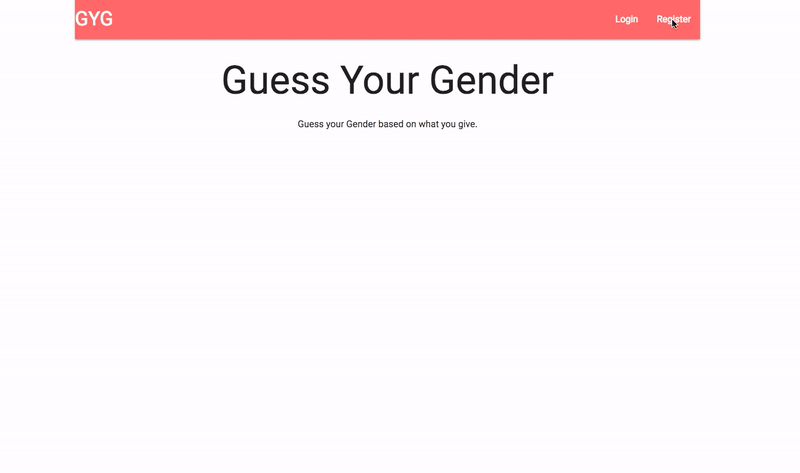

# Guess  Gender

**Live Server:** : [guess.geonyoon.com](http://guess.geonyoon.com)



Based on the text given by users, this app guesses their genders. Three different classifications are used to study Twitter's profile information. The studied model will predict the gender using the given inputs.

## Notable features

- Build a Kubernetes Cluster containing Front-end and Back-end containers
- Implement a full CI + CD workflow using Github, Travis CI, and Google Platform
- Machine learning model guesses users' gender 
- Naive Bayes Classifier, Multinomial Naive Bayes classifier, Logistic regression classifier are used to train the model
- Support full authentication system
- Private router restricts unauthenticated users to go to the private pages
- React and Django are used

## Run in a local environment

Install Docker in your local machine and run the following commands:

```script
https://github.com/GeonYoon/guessGender.git
cd guess_gender
docker-compose up --build
```

## Built With

* [Kubernetes](https://kubernetes.io/) - open-source system for automating deployment, scaling, and management of containerized applications
* [Docker](https://www.docker.com/) - computer program that performs operating-system-level virtualization
* [Django](https://www.djangoproject.com) - Python Web framework
* [Django REST framework](https://www.django-rest-framework.org) - To handle API requests
* [React](https://reactjs.org/) - Used to build client side
* [Redux](http://redux.js.org/docs/basics/UsageWithReact.html) - Predictable state container for JavaScript apps
* [Pickle](https://docs.python.org/3/library/pickle.html) - The pickle module implements binary protocols for serializing and de-serializing a Python object structure.
* [Joblib](https://pypi.org/project/joblib/) - Joblib is a set of tools to provide lightweight pipelining in Python
* [Google Cloud](https://cloud.google.com/) - Google Cloud

## Authors

* **Geon Yoon ** - *Initial work* - [GeonYoon](https://github.com/GeonYoon)
